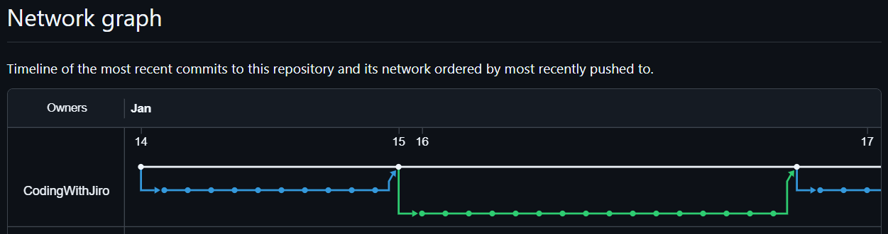
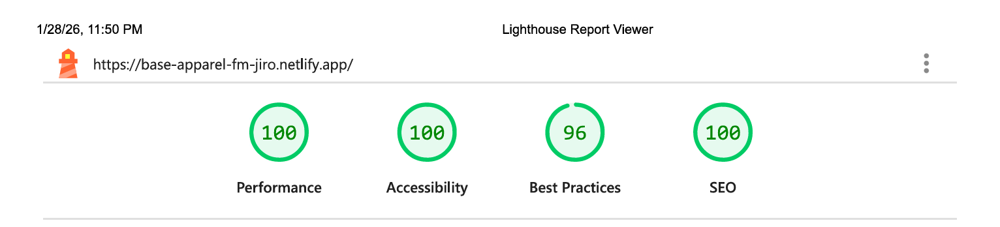

# Base Apparel Coming Soon

[](https://react.dev)
[](https://vitejs.dev)
[](https://tailwindcss.com)
[](https://vitest.dev)
[](https://testing-library.com)


[](https://www.frontendmentor.io/)
[](https://code.visualstudio.com/)
[](https://git-scm.com/)
[](https://github.com/)
[](https://www.netlify.com/)
[](https://chrome.google.com/webstore/detail/perfectpixel-by-welldonecod/dkaagdgjmgdmbnecmcefdhjekcoceebi)


[](/docs/downloads/lighthouse-performance-report.pdf)


## Base Apparel Announcements Email Subscription Page

| _Mobile Preview (375x812)_                                  | _Desktop Preview (1440x960)_                                   |
| ----------------------------------------------------------- | -------------------------------------------------------------- |
|       |       |
|  |  |

A responsive email subscription landing page built with React + Tailwind CSS, featuring client-side form validation and comprehensive component testing.

Created as part of the building challenges from **[Frontend Mentor](https://www.frontendmentor.io/)**.

---

## Overview

This is my first project that uses a modern **[React](https://react.dev)** + **[Tailwind CSS](https://tailwindcss.com)** implementation completing Frontend Mentor's **[Base Apparel Coming Soon challenge](https://www.frontendmentor.io/challenges/base-apparel-coming-soon-page-5d46b47f8db8a7063f9331a0)**.

The focus of this project was placed on form behavior, user experience, accessibility, and testing beyond layout and styling,

---

## Features

- Controlled email input with client-side validation using **[React](https://react.dev)**
- Responsive layout optimized for mobile and desktop using **[Tailwind CSS](https://tailwindcss.com)**
- Error handling triggered on meaningful user interactions
- Accessible form markup with semantic HTML
- Keyboard-friendly focus management
- Component-level tests using **[Vitest](https://vitest.dev)** and **[React Testing Library](https://testing-library.com)**
- Production deployment with performance auditing
- Light and dark mode support

---

## Development Workflow

[](https://github.com/CodingWithJiro/frontend-mentor-base-apparel-coming-soon/network)

> Click to view the full branch and merge history

This project adapts a **[granular branching and commit workflow](https://github.com/CodingWithJiro/frontend-mentor-base-apparel-coming-soon/network)** to simulate team collaboration. Each feature, fix, documentation, and chore is tracked in its own branch with descriptive commits.

Each **[pull request](REPO_PULL_REQUEST_CLOSED_LINK)** I created contains a clear description, change list, screenshots for UI updates, and reviewer notes.

_This ensures I maintain a professional workflow, even as a solo developer._

---

## What I Learned

- Installing the project dependencies such as React and Tailwind CSS libraries
- Familiarized myself into the initial scaffolding of a Vite + React project
- Gained experience on tweaking config files
- Managing form state and validation using React hooks
- Using `onFocus` and `onBlur` correctly to improve UX
- Translating native browser focus behavior into predictable React logic
- First time writing user-centric tests with **[Vitest](https://vitest.dev)** and **[React Testing Library](https://testing-library.com)**
- Avoiding brittle tests by testing behavior instead of implementation
- Applying Tailwind utility classes for interactive and accessible states

---

## Core Technologies

- HTML5
- CSS3
- JavaScript (ES6+)

## Frameworks & Libraries

- React
- Tailwind CSS

## Testing

- Vitest
- React Testing Library

## Tooling & Build

- Vite
- Git
- GitHub

## Design Reference

- Frontend Mentor (JPG)
- PerfectPixel

## Deployment

- Netlify

---

## How to Run

> Requires Node.js (v18+ recommended)

1. Open a terminal (Bash, Command Prompt, or PowerShell)

2. Clone the repository

```bash
git clone https://github.com/your-username/your-repo-name.git
```

3. Navigate to the project directory

```bash
cd REPO_NAME
```

4. Install dependencies

```bash
npm install
```

5. Start the development server

```bash
npm run dev
```

6. Open the local URL shown in the terminal (usually http://localhost:5173)

---

## Live Demo

Or you can check out the **[live website here](LINK)**

---

## Performance Report

[](docs/downloads/lighthouse-performance-report.pdf)

A **Google Lighthouse** audit was conducted on the final version of this project. You can view the **[full report here](docs/downloads/lighthouse-performance-report.pdf)**.

---

## Author

Created by **Elmar Chavez**

Month/Year: **January 2026**

Journey: **10<sup>th</sup>** month of learning _frontend web development_.

<!-- TODO: UPDATE DOCUMENTATION, SHOW NEW TOOLS, FINISH BEFORE JANUARY 31, POST IN LINKEDIN AFTER, SHARE STRUGGLES, AND THE LONG HIATUS WAS LEARNING REACT AND TAILWIND AND TESTING  -->
